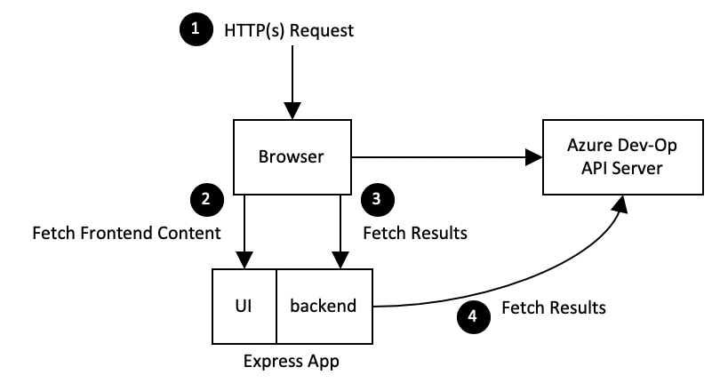

# Software Design Document
Reference: Introspection - Development and production setup of Dashboard 
Authors: Samiya Akhtar, Andre Briggs, Dennis Seah

| Revision | Date | Author | Remarks |
|--:|--|--|--|
| 0.1 | Mar-02, 2012 | Dennis Seah | Initial Draft |

## Background
This design is to fix a few things the current implementation of `spk deployment dasboard` command. They are
1. Exposing secret and configuration values in the browser.
2. Cross-origin resource sharing, CORS issue.

These problems surface because of how the React App is developed and deployed. 

The React App has only a frontend layer hence secret and configuration values need to be sent to the browser in order for the browser to make HTTP call to Azure Dev-Op API server (which leads to CORS error).

## Out of Scope
This design shall only address the above mentioned issues, see [Background Section](#background). There a few known issues, see [Known issues](#known-issues) section; and they shall be addressed in separate software design proposal.

## Design Details
A backend layer is introduced in order to fix the above mentioned issues and the landscape looks like this.

1. Secret and configuration values need not be send to the browser because the backend is making the Azure Dev-Op API calls.
2. We do not have CORS issue because these HTTP calls are from the backend of the App.

### Building and Running the expressJs App
The frontend and backend calls are serviced by an expressJS app. This is how this application is built in the workspace.

1. Building react frontend app
`react-scripts-ts build`
2. Building backend app `tsc src/backend/** --outDir build/backend/`
3. Building expressJS app `tsc src/server.ts --outDir build/`

All the resources and code for the expressJS app is in the build folder; and the app runs from the folder. All backend calls are prefixed with `api/`.

Secret and configuration values are exposed to the expressJS app via environment parameters; and they are never exposed in the frontend layer.

### Running React Service Worker

In order to faciliate code development (mainly in frontend), the react's worker service is used. And it proxies all requests with `api/` prefix to an Express application running at port 8001.

Similarly, secret and configuration values are exposed to the expressJS app via environment parameters; and they are never exposed in the frontend layer.

## Known issues

### Too many calls to Azure Dev-Op API server.
Every call from the frontend to the backend layer shall result in a call to the Azure Dev-Op API server. This can be a huge overhead and this can be resolved by having a caching mechanism in the backend.

### Multiple HTTP calls from frontend to backend API
The frontend layer is making multiple HTTP calls to the backend in order to render a complete view. For instance, one call to get deployments; other call to get author for each deployment; etc. This result in poor user experience.

## Security Concerns
None

## Documentation
1. Where is the docker image?
2. What are the environment parameters to export?

## References
1. https://daveceddia.com/create-react-app-express-backend/
2. https://daveceddia.com/deploy-react-express-app-heroku/
3. https://docs.docker.com/engine/reference/commandline/run/

\- end -
